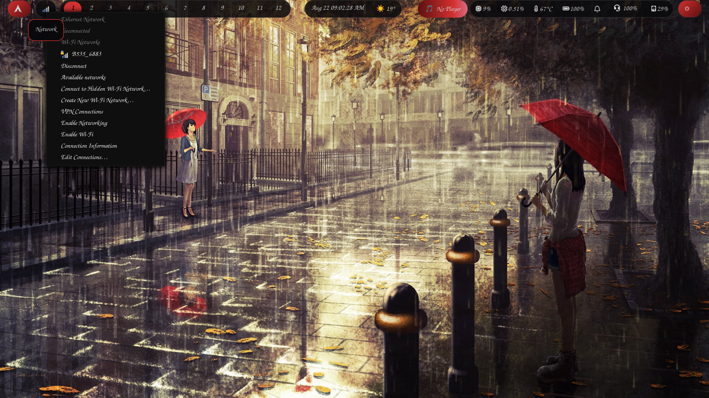
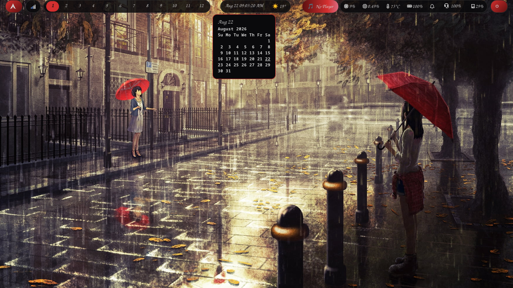
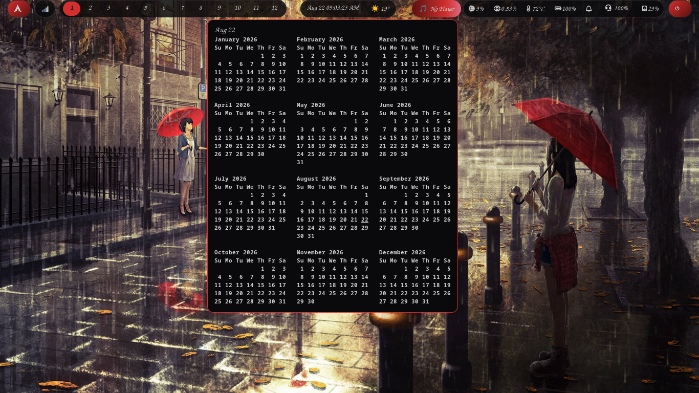

# fht-compositor Dotfiles

Smithay-based dynamic tiling Wayland compositor riced with the **Crimson Rain** theme:
12 native workspaces, sheer transparent Waybar, and vibrant crimson accents.

---

## ✨ Features

- **12 Native Workspaces:** Custom patched from source to bypass the default 9-workspace limit, with full Waybar integration.
- **Crimson Rain Theme:** Sheer transparent Waybar pills, muted dark borders, and vibrant crimson (`#D32F2F`) accents.
- **Seamless X11 Bridge:** `xwayland-satellite` pre-configured for flawless X11 app support.
- **Rofi** launcher & powermenu, **swaybg** wallpaper, and **grim** screenshots with desktop notifications.

## 📖 Documentation & Installation

For full instructions, the manual cargo build process, keybinds, and the complete technical guide, please visit the **[Official Documentation Website](https://wgparch.codeberg.page/fht/)**.

Quick setup:

1. Clone this repository and copy configs: `cp -r configs/fht ~/.config/fht`
2. Follow the Installation Guide to manually build the patched compositor.

## 📸 Screenshots

1. 
2. 
3. 
4. 
5. 
6. 
