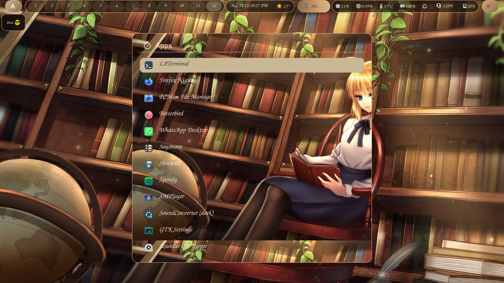

# SimpleWC

Welcome to my **SimpleWC** dotfiles. 

SimpleWC is a minimal, stacking Wayland compositor based on wlroots. This configuration features a custom **"Warm Library"** aesthetic, 12 persistent workspaces using the `dwl/tags` protocol, and a fully functional Pure Wayland environment.

